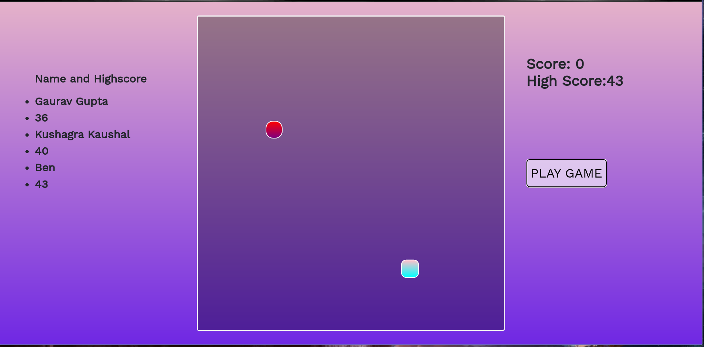

<h1 align="center">Hey Developers! Presenting you all the 'Snake Game'. </h1>

## [Visit to play](https://gaurav147-star.github.io/Snake-Blast/)

### Everyone is familiar with this game.We enjoy this game.I have made this game using HTML,CSS,JavaScript and Firebase.

<h3>How to play?</h3>

#### This is a simple game which can be played on desktop.
#### You can use left and right arrow keys to move the snake.
#### When you start the game you can see high score in right side and left side displays the name of the person with highest score.
#### If you break the highscore then you will be asked to enter you name with the highscore, which will further be displayed in the game.

---

## Application Screenshots

<!--  -->
---

